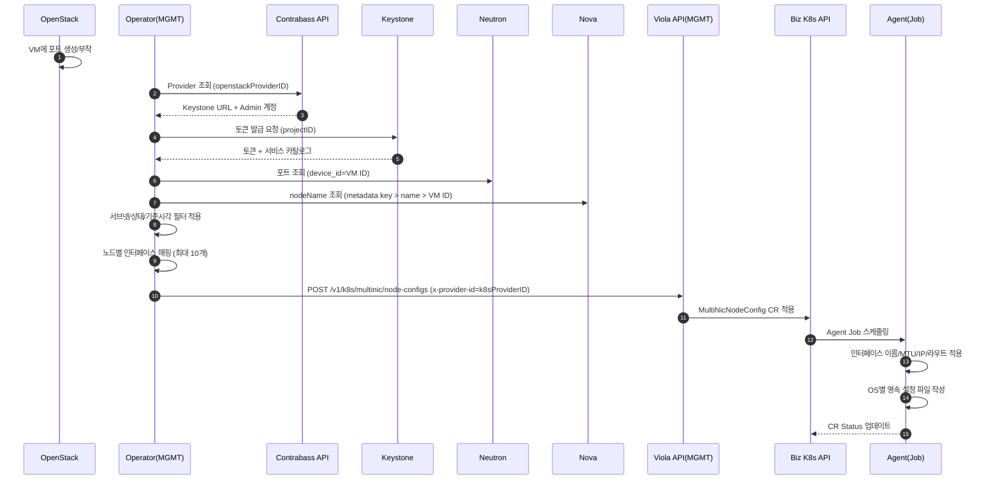
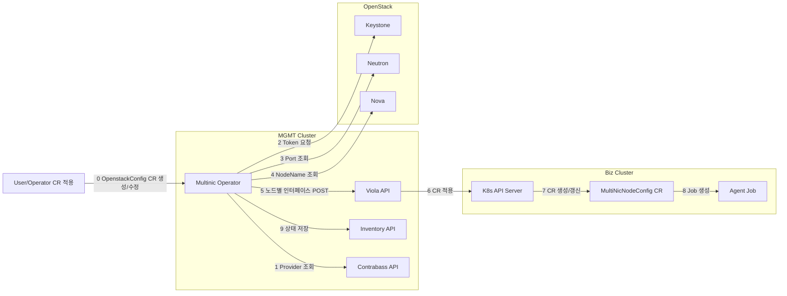

# MultiNIC 전체 플로우

## 시퀀스 흐름

## 아키텍처

## 단계별 상세 설명

0) 시작 조건  
   - 사용자가 OpenstackConfig CR을 생성/수정  
   - OpenStack에서 VM에 포트를 새로 부착  
   - **CR 생성 시각 이후에 생성된 포트만 처리** (기존 포트는 제외)

0-1) OpenstackConfig에 넣는 정보(의미)  
   - `subnetIDs/subnetID/subnetName`: 멀티 NIC 대상 서브넷 선택 기준  
   - `vmNames`: 포트를 조회할 대상 VM ID 목록(device_id 매칭)  
   - `credentials.openstackProviderID`: Contrabass에서 OpenStack 접속정보 조회용  
   - `credentials.projectID`: Keystone 토큰 발급 대상 프로젝트  
   - `credentials.k8sProviderID`: Viola 라우팅 키(x-provider-id)  
   - `settings.violaEndpoint`: 인터페이스 정보를 POST할 Viola API 주소  
   - `contrabassEncryptKey`: Contrabass 응답 adminPw 복호화 키

1) Provider 조회  
   - Contrabass API로 `openstackProviderID` 기반 **대상 OpenStack 접속 정보를 조회**  
   - 결과: Keystone URL, Admin ID, 암호화된 Admin PW, 도메인, Nova/Neutron 관련 URL 정보

2) Token 요청  
   - Keystone에 `projectID`로 토큰 요청  
   - 이유: Neutron/Nova API 호출을 위한 인증 토큰이 필요  
   - Service Catalog: OpenStack 서비스(Neutron/Nova 등)의 **엔드포인트 목록**  
     - 지역/인터페이스(public/internal)별 URL을 찾기 위해 사용

3) Port 조회  
   - Neutron에서 `device_id == VM ID` 조건으로 포트를 조회  
     - OpenstackConfig의 `vmNames`(= VM ID) 기준으로 포트 수집  
   - `subnetIDs/subnetID/subnetName` 필터로 대상 서브넷만 선별  
     - 여러 네트워크 중 **멀티 NIC로 붙인 서브넷만** 처리하기 위함  
   - `openstackPortAllowedStatuses` 필터  
     - 처리 대상 포트 상태를 제한 (예: `ACTIVE`, `DOWN`)  
     - `DOWN`은 방금 붙여서 아직 활성화되지 않은 포트를 포함하기 위한 선택지  
     - `ACTIVE`로 표시되어도 실제 OS에서는 아직 활성화 전일 수 있어 둘 다 확인

4) NodeName 조회  
   - Nova에서 VM 정보를 조회해 **K8s 노드명**을 결정  
   - 이유: MultiNicNodeConfig는 **K8s 노드명** 기준으로 생성되어야 함  
   - `settings.openstackNodeNameMetadataKey`가 있으면 metadata 값을 우선 사용  
     - 없으면 Nova 서버 이름을 사용 (매핑 실패 시 VM ID로 대체)

5) 노드별 인터페이스 매핑  
   - VM별 포트를 묶어 `NodeConfig` 구성  
   - 서브넷별 CIDR/MTU 정보를 결합해 Agent가 적용할 데이터로 변환  
   - 노드당 최대 10개(`multinic0~9`) 제한 적용

6) Viola API POST  
   - `violaEndpoint`로 인터페이스 목록 전송  
   - 헤더 `x-provider-id = k8sProviderID` 사용

7) CR 적용  
   - Viola API가 Biz 클러스터에 `MultiNicNodeConfig` 적용 요청

8) Job 생성/실행  
   - Biz 클러스터 Agent가 노드별 Job 실행  
   - 인터페이스 이름/MTU/IP/라우트 적용 및 영속 파일 작성

9) 상태 저장  
   - Operator가 Inventory에 최신 스냅샷 저장  
   - 조회 API에서 k8sProviderID 기준으로 검색 가능
