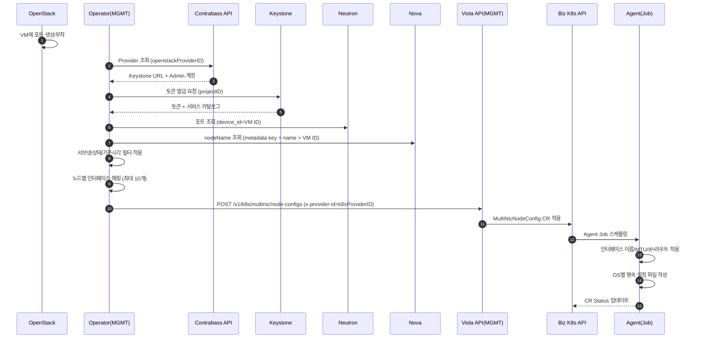
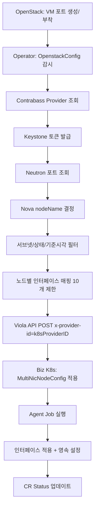
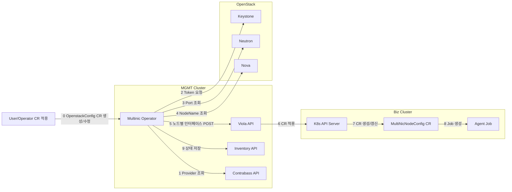

# MultiNIC 전체 플로우

## 시퀀스 흐름

## 흐름도 (Flowchart)

## 아키텍처

## 단계별 상세 설명

1) Provider 조회  
   - Contrabass API로 `openstackProviderID` 기반 **대상 OpenStack 접속 정보를 조회**  
   - 결과: Keystone URL, Admin ID, 암호화된 Admin PW, 도메인, Nova/Neutron 관련 URL 정보

2) Token 요청  
   - Keystone에 `projectID`로 토큰 요청  
   - 결과: Token + Service Catalog 획득

3) Port 조회  
   - Neutron에서 `device_id == VM ID` 조건으로 포트 조회  
   - `subnetIDs/subnetID/subnetName` 필터로 대상 서브넷만 선별  
   - `openstackPortAllowedStatuses`에 포함된 상태만 처리

4) NodeName 조회  
   - Nova에서 VM 정보를 조회해 노드명 결정  
   - `settings.openstackNodeNameMetadataKey` 값이 있으면 metadata 우선, 없으면 서버 이름 사용

5) 노드별 인터페이스 매핑  
   - VM별 포트를 묶어 `NodeConfig` 구성  
   - 노드당 최대 10개(`multinic0~9`) 제한 적용

6) Viola API POST  
   - `violaEndpoint`로 인터페이스 목록 전송  
   - 헤더 `x-provider-id = k8sProviderID` 사용

7) CR 적용  
   - Viola API가 Biz 클러스터에 `MultiNicNodeConfig` 적용 요청

8) Job 생성/실행  
   - Biz 클러스터 Agent가 노드별 Job 실행  
   - 인터페이스 이름/MTU/IP/라우트 적용 및 영속 파일 작성

9) 상태 저장  
   - Operator가 Inventory에 최신 스냅샷 저장  
   - 조회 API에서 k8sProviderID 기준으로 검색 가능
