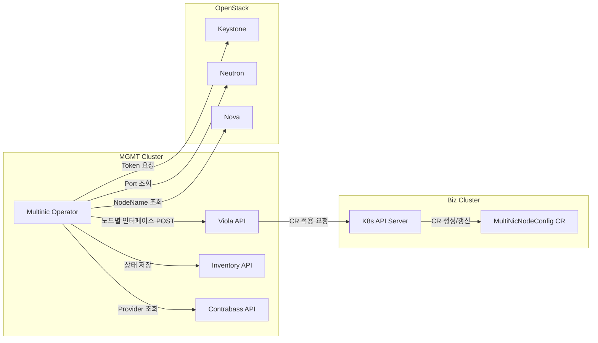
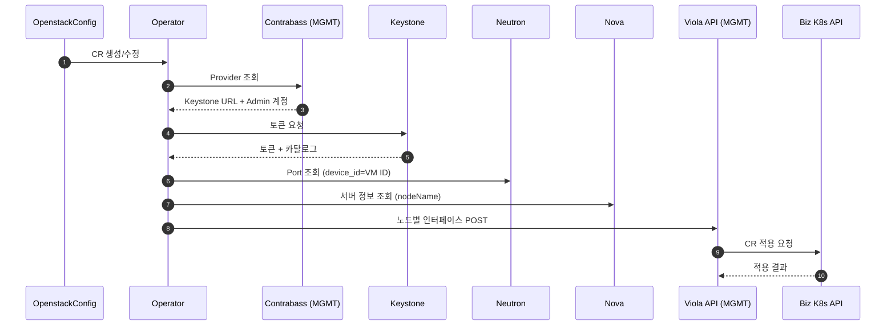

# multinic-operator

MGMT 클러스터에서 OpenstackConfig CR을 감시하고 OpenStack 네트워크 정보를 수집한 뒤
MGMT 클러스터에 배포된 Viola API로 노드별 인터페이스 정보를 전송하는 오퍼레이터입니다.

## 개요

- 입력: OpenstackConfig CR (openstackProviderID, k8sProviderID, projectID, VM ID 목록 + settings/secrets)
- 처리: Contrabass → Keystone → Neutron 포트 조회
- 출력: Viola API로 JSON POST (MultiNicNodeConfig 생성용, subnetIDs 우선/없으면 subnetID/subnetName)
- 저장: 오퍼레이터 내부 Inventory API + 파일 기반 DB(JSON)에 최신 상태 upsert (UI 조회용)

### 핵심 기능 요약

- 서브넷 지정: `subnetIDs` > `subnetID` > `subnetName` 우선순위 적용
- 라우팅 키: Viola 요청 헤더 `x-provider-id`는 **k8sProviderID 필수**
- 인터페이스 상한: 노드당 최대 10개 (`multinic0~multinic9`)
- Agent 지원 OS: Ubuntu(netplan), RHEL(NetworkManager) 기반 영속 설정
  - 상세 내용은 `../multinic-agent/README.md` 참고

주의:
- `subnetIDs` > `subnetID` > `subnetName` 순서로 적용합니다.
- `subnetName`은 네트워크명이 아니라 **서브넷 이름**입니다. (동일 이름이 있으면 오류)
- `vmNames`에는 **VM ID(UUID)** 를 넣어야 합니다.
- nodeName은 Nova 서버 이름을 사용하며, 필요 시 `settings.openstackNodeNameMetadataKey`로
  metadata 값을 우선 사용하도록 설정할 수 있습니다.
- 포트 상태가 `settings.openstackPortAllowedStatuses`에 포함되지 않거나,
  대상 노드의 인터페이스가 비어 있으면 해당 노드는 전송에서 제외됩니다.
- OpenstackConfig **생성 시각 이후에 생성된 포트만** 처리합니다.
- DOWN 포트가 남아 있으면 빠른 재시도 후(기본 5회) 느린 주기로 재전송합니다.
- 인터페이스는 `subnetIDs` 순서대로 정렬한 뒤 normalize 단계에서 MAC/PortID 기준으로 재정렬됩니다.
  (현재 동작: 최종 `multinic` 순서는 MAC 기준)

## 전제

- Go 1.25+
- Kubernetes 클러스터 접근 권한
- Contrabass/OpenStack API 접근 가능

## OpenstackConfig 설정

운영 환경에서는 Helm 배포 시 **이미지 정보만 설정**하고,
실제 접속 정보는 OpenstackConfig CR로 전달합니다.

필수 필드:
- `subnetIDs` 또는 `subnetID` 또는 `subnetName` (subnetIDs/subnetID 권장)
- `vmNames`: VM ID(UUID) 목록
- `credentials.openstackProviderID`
- `credentials.k8sProviderID`
- `credentials.projectID`

동작 규칙:
- `subnetIDs`가 있으면 `subnetID`/`subnetName`은 무시됩니다.

선택 필드:
- `settings`: Contrabass/Viola/OpenStack/폴링 옵션
- `secrets.contrabassEncryptKeySecretRef` (권장)

기본 암호화 키:
- `<namespace>/contrabass-encrypt-key` Secret의 `CONTRABASS_ENCRYPT_KEY`를 자동 사용
- Secret이 없으면 `settings.contrabassEncryptKey`를 사용

Secret 예시:

```yaml
apiVersion: v1
kind: Secret
metadata:
  name: contrabass-encrypt-key
  namespace: multinic-system
type: Opaque
stringData:
  CONTRABASS_ENCRYPT_KEY: "conbaEncrypt2025"
```

Viola API 주소:
- `spec.settings.violaEndpoint`가 있으면 CR별로 사용
- 없으면 Helm values의 `operatorConfig.violaEndpoint`(= `VIOLA_ENDPOINT`)를 사용

OpenstackConfig 예시:

```yaml
apiVersion: multinic.example.com/v1alpha1
kind: OpenstackConfig
metadata:
  name: openstackconfig-sample
  namespace: multinic-system
spec:
  subnetIDs:
    - "8f0d5f5b-8f3f-4b2b-9c4c-8c9f7c36d1f2"
    - "dae4f6ea-76ae-4e56-b3a5-87e6df94a574"
  vmNames:
    - "08186d75-754e-449c-b210-c0ea822727a7"
    - "c863944f-5cfe-4e05-805f-7522f3e9b080"
    - "fbfd0e4d-a4bb-4769-bceb-46cb4b0dc3c5"
  credentials:
    openstackProviderID: "66da2e07-a09d-4797-b9c6-75a2ff91381e"
    projectID: "0d5f63c52fc94aeeb767e69790fa73c8"
    k8sProviderID: "f5861c22-b252-42b5-a0c5-cfb1d245c819"
  settings:
    contrabassEndpoint: "https://expert.bf.okestro.cloud"
    violaEndpoint: "http://viola-api.multinic-system.svc.cluster.local:8080"
    openstackPortAllowedStatuses:
      - "ACTIVE"
      - "DOWN"
    pollFastInterval: "10s"
    pollSlowInterval: "2m"
  secrets:
    contrabassEncryptKeySecretRef:
      name: contrabass-encrypt-key
      key: CONTRABASS_ENCRYPT_KEY
```

## 동작 흐름

### 아키텍처



### 시퀀스



1) OpenstackConfig CR 이벤트 발생
2) Contrabass provider 조회 및 adminPw 복호화
3) Keystone 토큰 발급 (서비스 카탈로그 포함)
4) Neutron 엔드포인트 결정 (카탈로그 또는 settings)
5) subnetIDs/subnetID/subnetName → subnet/network 조회 (CIDR/MTU 확보)
6) Neutron 포트 조회 (device_id == VM ID)
7) Nova 서버 조회로 nodeName 결정 (metadata key > server name > vmID)
8) 대상 subnet에 포함된 포트만 선별
9) 노드별 인터페이스 구성
10) Viola API POST
11) 파일 기반 DB(JSON) 최신 상태 upsert (`k8sProviderID` + nodeName 기준)
12) 변경 직후 빠른 폴링 → 안정 구간은 느린 폴링

## Viola API 요청 스펙

Operator가 OpenStack 포트 정보를 수집한 뒤 MGMT 클러스터에 배포된 Viola API로 POST 요청을 보냅니다.
Viola API 주소는 `spec.settings.violaEndpoint`가 우선이며, 없으면 Helm values의
`operatorConfig.violaEndpoint`로 설정합니다.

- Endpoint: `POST /v1/k8s/multinic/node-configs`
- Headers:
  - `x-provider-id` (string, required): `OpenstackConfig.spec.credentials.k8sProviderID`
- Request Body: 노드별 MultiNicNodeConfig 목록(JSON 배열)

요청 필드:

| 구분 | key | type | required | description |
| --- | --- | --- | --- | --- |
| Body | `nodeName` | string | O | K8s 노드명 |
| Body | `instanceId` | string | O | OpenStack VM ID |
| Body | `interfaces` | array | O | 노드에 부착된 인터페이스 목록 |
| Body | `interfaces[].id` | int | O | 0~9 |
| Body | `interfaces[].name` | string | O | `multinic0`~`multinic9` |
| Body | `interfaces[].macAddress` | string | O | MAC 주소 |
| Body | `interfaces[].address` | string | O | IPv4 주소 |
| Body | `interfaces[].cidr` | string | O | 서브넷 CIDR |
| Body | `interfaces[].mtu` | int | O | MTU |

`x-provider-id` 값은 `OpenstackConfig.spec.credentials.k8sProviderID`를 사용합니다.

예시 (요청 헤더 포함, 2개 노드/각 3개 인터페이스):

```http
POST /v1/k8s/multinic/node-configs HTTP/1.1
Host: viola-api.example.com
Content-Type: application/json
x-provider-id: f5861c22-b252-42b5-a0c5-cfb1d245c819

[
  {
    "nodeName": "worker-1",
    "instanceId": "i-0123456789abcdef0",
    "interfaces": [
      {
        "id": 0,
        "name": "multinic0",
        "macAddress": "00:1A:2B:3C:4D:5E",
        "address": "192.168.1.100",
        "cidr": "192.168.1.0/24",
        "mtu": 1500
      },
      {
        "id": 1,
        "name": "multinic1",
        "macAddress": "00:1A:2B:3C:4D:5F",
        "address": "192.168.1.101",
        "cidr": "192.168.1.0/24",
        "mtu": 1500
      },
      {
        "id": 2,
        "name": "multinic2",
        "macAddress": "00:1A:2B:3C:4D:60",
        "address": "192.168.1.102",
        "cidr": "192.168.1.0/24",
        "mtu": 1500
      }
    ]
  },
  {
    "nodeName": "worker-2",
    "instanceId": "i-0fedcba9876543210",
    "interfaces": [
      {
        "id": 0,
        "name": "multinic0",
        "macAddress": "00:1A:2B:3C:4D:61",
        "address": "192.168.2.10",
        "cidr": "192.168.2.0/24",
        "mtu": 1500
      },
      {
        "id": 1,
        "name": "multinic1",
        "macAddress": "00:1A:2B:3C:4D:62",
        "address": "192.168.2.11",
        "cidr": "192.168.2.0/24",
        "mtu": 1500
      },
      {
        "id": 2,
        "name": "multinic2",
        "macAddress": "00:1A:2B:3C:4D:63",
        "address": "192.168.2.12",
        "cidr": "192.168.2.0/24",
        "mtu": 1500
      }
    ]
  }
]
```

## Helm 배포

차트 경로: `deployments/helm`

Helm values에는 **이미지 정보가 필수**입니다.
Viola API 주소는 CR에서 지정하지 않는 경우에만 Helm values로 설정합니다.

배포 예시:

```sh
helm upgrade --install multinic-operator deployments/helm \
  -n multinic-operator-system --create-namespace \
  --set image.repository=nexus.okestro-k8s.com:50000/multinic-operator \
  --set image.tag=dev-20260113062309 \
  --set image.pullSecrets[0].name=nexus-regcred
```

values.yaml 작성 예시(필수):

```yaml
image:
  repository: nexus.okestro-k8s.com:50000/multinic-operator
  tag: "dev-20260113062309"
  pullSecrets:
    - name: nexus-regcred
operatorConfig:
  # CR에서 violaEndpoint를 지정하지 않을 때만 사용
  violaEndpoint: "https://viola-api.example.com"
```

values.yaml 작성 예시(선택):

```yaml
inventory:
  enabled: true
  service:
    port: 18081
persistence:
  enabled: false
```

`spec.settings.violaEndpoint`를 사용하면 CR별로 Viola API 주소를 지정할 수 있습니다.
CR에 값이 없으면 `operatorConfig.violaEndpoint`를 기본값으로 사용합니다.

## 오프라인 이미지 배포

사내망에서 인터넷 접근이 불가능할 때는 이미지 tar를 옮겨서 로드한 뒤
사내 Nexus로 push하고 Helm values에 반영합니다.

이미지 tar 경로:
- `images/multinic-operator_dev-20260113062309.tar`

예시:

```sh
# 이미지 로드
nerdctl load -i images/multinic-operator_dev-20260113062309.tar

# Nexus에 태그/푸시
nerdctl tag multinic-operator:dev-20260113062309 nexus.okestro-k8s.com:50000/multinic-operator:dev-20260113062309
nerdctl push nexus.okestro-k8s.com:50000/multinic-operator:dev-20260113062309
```

## Interfaces API (오퍼레이터 내장)

오퍼레이터가 계산한 **최신 노드별 인터페이스 스냅샷**을 조회하는 내부 API입니다.
UI 조회/디버깅 용도로 사용하며, 실제 적용 상태는 Biz 클러스터의 `MultiNicNodeConfig`가 기준입니다.

노출 API (3개):
- 클러스터(Provider) 요약 조회: `GET /v1/interfaces/providers`
- 특정 클러스터 전체 노드 조회: `GET /v1/interfaces/node-configs?providerId=...`
  - `providerId`는 **k8sProviderID**이며 필수
- instanceId 단건 조회: `GET /v1/interfaces/node-configs/by-instance/{instanceId}?providerId=...`
  - `instanceId` 필수, `providerId`는 중복 방지를 위해 권장

Kubernetes Service:
- Kustomize: `inventory-service` (port 18081, namespace `system`)
- Helm: `<release>-multinic-operator-inventory` (port 18081)

주의: 파일 기반 저장소이므로 오퍼레이터는 1개 replica로 운영하는 것을 권장합니다.
지속 저장이 필요하면 `config/manager/manager.yaml`의 `emptyDir`를 PVC로 교체하십시오.

Swagger 문서(Operator -> Viola POST 페이로드):
- `GET /openapi.yaml`
- `GET /docs` (Swagger UI, CDN 사용)
  - POST(viola) + Interfaces API(조회용)가 포함됩니다.
  - Swagger는 현재 접속한 주소(호스트/포트)를 기준으로 호출합니다.

### Inventory API 확인 예시

```sh
kubectl -n multinic-operator-system port-forward svc/<inventory-service-name> 18081:18081
curl -s "http://127.0.0.1:18081/v1/interfaces/providers"
curl -s "http://127.0.0.1:18081/v1/interfaces/node-configs?providerId=<k8s-provider-id>"
curl -s "http://127.0.0.1:18081/v1/interfaces/node-configs/by-instance/<instanceId>?providerId=<k8s-provider-id>"
```

추천 조회 흐름:
1) `/v1/interfaces/providers`로 providerId 목록 확인
2) 해당 providerId로 `/v1/interfaces/node-configs` 조회
3) 필요한 instanceId로 `/v1/interfaces/node-configs/by-instance/{instanceId}` 조회
   - 동일 instanceId가 겹치면 providerId를 추가

`/v1/interfaces/providers` 응답 예시:

```json
{
  "providers": [
    {
      "providerId": "f5861c22-b252-42b5-a0c5-cfb1d245c819",
      "nodeCount": 3,
      "updatedAt": "2026-01-12T02:51:32Z",
      "nodes": [
        {
          "providerId": "f5861c22-b252-42b5-a0c5-cfb1d245c819",
          "nodeName": "infra01",
          "instanceId": "ec4bdcc1-dbcc-4c5d-88a4-581a14beca2d",
          "interfaceCount": 3,
          "updatedAt": "2026-01-12T02:51:32Z"
        }
      ]
    }
  ]
}
```

노드 상세 응답 예시 (`/v1/interfaces/node-configs`, `/by-instance`):

```json
[
  {
    "providerId": "f5861c22-b252-42b5-a0c5-cfb1d245c819",
    "nodeName": "manager01",
    "instanceId": "08186d75-754e-449c-b210-c0ea822727a7",
    "config": {
      "nodeName": "manager01",
      "instanceId": "08186d75-754e-449c-b210-c0ea822727a7",
      "interfaces": [
        {
          "id": 0,
          "name": "multinic0",
          "macAddress": "fa:16:3e:aa:bb:cc",
          "address": "10.0.0.10",
          "cidr": "10.0.0.0/24",
          "mtu": 1450
        }
      ]
    },
    "lastConfigHash": "a69f59021cf9a8f7",
    "updatedAt": "2026-01-11T01:23:45Z"
  }
]
```

응답 코드:
- `200 OK`: 조회 성공
- `400 Bad Request`: nodeName 누락 등 요청 오류
- `404 Not Found`: 조건에 맞는 데이터 없음
- `503 Service Unavailable`: inventory 저장소 비활성


## Status Conditions

OpenstackConfig에는 동기화 상태를 나타내는 Conditions가 갱신됩니다.

- `Ready`: 동기화 성공 여부
- `Degraded`: 오류 발생 여부

추가 상태 필드:
- `lastSyncedAt`: 마지막 성공 동기화 시각(Reason=Synced/NoChange일 때 갱신)
- `lastError`: 마지막 오류 메시지

## 설치/배포 (기본)

```sh
make install
make deploy IMG=<registry>/multinic-operator:tag
```

샘플 CR 적용:

```sh
kubectl apply -k config/samples/
```

## 테스트용 Viola API

Viola 개발 API가 준비되기 전까지 아래 테스트용 API를 배포해 POST 수신 및 CR 생성까지 확인할 수 있습니다.

```sh
# 라우팅 Secret(viola-api-routing)을 먼저 준비해야 합니다.
kubectl apply -f config/test/viola-test-api.yaml
```

동작 방식:
- POST payload를 `MultiNicNodeConfig`로 변환
- `kubectl apply -f`로 CR 생성/갱신

API 문서(테스트용):

- `GET /healthz`
  - Response: `200 OK` + `ok` (plain text)
- `GET /openapi.yaml`
  - OpenAPI 스펙 (YAML)
- `GET /docs`
  - Swagger UI (CDN 사용, 오프라인에서는 동작하지 않을 수 있음)

- `POST /v1/k8s/multinic/node-configs`
  - Headers:
    - `Content-Type: application/json`
    - `x-provider-id` (required, 라우팅 키)
  - Request Body: `[]NodeConfig` (JSON 배열)
  - Response `200 OK`:
    ```json
    {"applied":3,"output":"multinicnodeconfig.multinic.io/node-1 configured"}
    ```
  - Response `400 Bad Request`:
    - 잘못된 JSON/필수 필드 누락/라우팅 설정 오류
  - Response `500 Internal Server Error`:
    - `kubectl apply` 실패(검증 실패/접속 실패 등)

라우팅(테스트용):
- 요청 헤더 `x-provider-id`를 기준으로 대상 클러스터를 선택합니다.
  - 값은 `OpenstackConfig.spec.credentials.k8sProviderID`를 사용합니다.
- `ROUTING_CONFIG`에 라우팅 파일을 지정하면 providerId별로 대상 클러스터를 선택합니다.
- 모드:
  - `ssh`(테스트 권장): 원격 Bastion에 SSH로 접속해 `kubectl apply`.
  - `local`: `kubeApiServer/kubeToken/kubeCaPath`로 원격 클러스터에 `kubectl apply`.
- 샘플 파일: `config/test/viola-routing.sample.yaml`
- `strict: true`로 설정하면 providerId가 없거나 매칭 실패 시 400으로 실패합니다.
- SSH 모드는 `sshpass`가 필요하며 테스트용 Viola API 이미지에는 포함되어 있습니다.

라우팅 Secret 생성 예시(테스트용):

```sh
# routing.yaml과 ca.crt를 준비한 뒤 Secret 생성
kubectl -n multinic-system create secret generic viola-api-routing \
  --from-file=routing.yaml=./routing.yaml \
  --from-file=ca.crt=./ca.crt
```

라우팅 예시:

```yaml
strict: true
targets:
  - providerId: "f5861c22-b252-42b5-a0c5-cfb1d245c819"
    mode: ssh
    namespace: "multinic-system"
    sshHost: "192.168.3.170"
    sshUser: "root"
    sshPort: 22
    sshPass: "cloud1234"
    kubectlPath: "kubectl"
```

이미지 빌드 예시:

```sh
nerdctl build -f Dockerfile.viola-test-api -t <registry>/multinic-viola-test-api:dev .
```

## QA 테스트 체크리스트

- [x] 3개 노드에 3개 포트씩 일괄 추가 후 CR 반영 확인
- [x] 포트 제거 시 CR 반영 확인
- [x] DOWN 포트 필터링(`openstackPortAllowedStatuses=ACTIVE`) 동작 확인
- [x] 설정 누락 시 ConfigError 발생/복구 확인 (`contrabassEndpoint`)
- [x] 중복 변경 스킵(`no changes detected`) 확인
- [x] 잘못된 VM ID/Project ID 입력 시 오류 처리 확인
- [x] Viola API 장애/timeout 시 재시도 동작 확인
- [x] Inventory API 조회 응답 확인
- [x] Interfaces API: providerId 미입력 시 400 확인
- [x] Interfaces API: 잘못된 instanceId 조회 시 404 확인
- [x] Viola API: x-provider-id 누락 시 400 확인
- [x] Viola API: 정상 payload POST 200 확인
- [x] 멀티 서브넷(test/test2) 동시 부착 동작 확인
- [x] worker/master 다중 노드 동시 적용 확인
- [x] Viola API 라우팅(ssh) 적용 확인
- [x] OpenstackConfig 생성 시각 이후 포트만 처리되는지 확인
- [x] 노드당 인터페이스 10개 초과 시 10개만 전송( `multinic0~9` ) 확인
- [x] `subnetIDs` 순서대로 인터페이스 매핑되는지 확인
- [x] `subnetIDs` 순서 변경 시 최종 인터페이스 순서가 MAC 기준으로 유지됨(현 동작)
- [x] OpenstackConfig에서 `vmNames` 제거 시 기존 Inventory/CR 삭제는 하지 않음(현 동작)
- [x] Viola API 엔드포인트 오류 시 Ready/Degraded 갱신 확인
- [x] Viola API 장애 복구 후 정상 동기화 확인
- [x] 중복 OpenstackConfig 생성 시 baseline 이전 포트는 전송되지 않음(현 동작)
- [x] DOWN 포트가 ACTIVE로 전환되면 정상 전송됨을 확인
- [x] 오퍼레이터 재시작 후 Inventory가 재동기화됨을 확인
