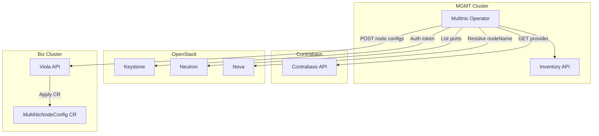
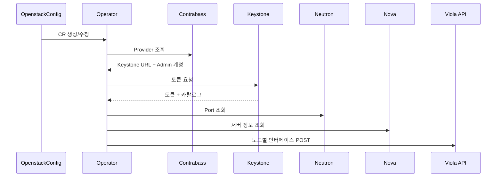

# multinic-operator

MGMT 클러스터에서 OpenstackConfig CR을 감시하고 OpenStack 네트워크 정보를 수집한 뒤
Viola API로 노드별 인터페이스 정보를 전송하는 오퍼레이터입니다.

## 개요

- 입력: OpenstackConfig CR (providerID, projectID, VM ID 목록 + settings/secrets)
- 처리: Contrabass → Keystone → Neutron 포트 조회
- 출력: Viola API로 JSON POST (MultiNicNodeConfig 생성용, subnetID 우선/없으면 subnetName)
- 저장: 오퍼레이터 내부 Inventory API + 파일 기반 DB(JSON)에 최신 상태 upsert (UI 조회용)

주의:
- `subnetID`가 **우선**이며, 없을 때만 `subnetName`을 사용합니다.
- `subnetName`은 네트워크명이 아니라 **서브넷 이름**입니다. (동일 이름이 있으면 오류)
- `vmNames`에는 **VM ID(UUID)** 를 넣어야 합니다.
- 포트 상태가 `OPENSTACK_PORT_ALLOWED_STATUSES`에 포함되지 않거나,
  대상 노드의 인터페이스가 비어 있으면 해당 노드는 전송에서 제외됩니다.
- DOWN 포트가 남아 있으면 빠른 재시도 후(기본 5회) 느린 주기로 재전송합니다.
- 인터페이스 `id`는 0~9이며, `name`(multinic0~9)과 동일한 인덱스로 전송됩니다.

## 전제

- Go 1.25+
- Kubernetes 클러스터 접근 권한
- Contrabass/OpenStack API 접근 가능

## 환경 변수

운영 기본값/전역 정책을 ConfigMap/Secret로 주입합니다.
CR에 settings가 있으면 **CR 값이 우선**이며, 없을 때만 환경 변수를 사용합니다.

```
CONTRABASS_ENDPOINT=...        # CR에 없을 때만 사용
CONTRABASS_ENCRYPT_KEY=...     # CR secrets/settings에 없을 때만 사용
CONTRABASS_TIMEOUT=30s
CONTRABASS_INSECURE_TLS=true

OPENSTACK_TIMEOUT=30s
OPENSTACK_INSECURE_TLS=true
OPENSTACK_NEUTRON_ENDPOINT=
OPENSTACK_NOVA_ENDPOINT=
OPENSTACK_ENDPOINT_INTERFACE=public
OPENSTACK_ENDPOINT_REGION=
OPENSTACK_NODE_NAME_METADATA_KEY=
OPENSTACK_PORT_ALLOWED_STATUSES=ACTIVE,DOWN
DOWN_PORT_FAST_RETRY_MAX=5

POLL_FAST_INTERVAL=20s
POLL_SLOW_INTERVAL=2m
POLL_ERROR_INTERVAL=30s
POLL_FAST_WINDOW=3m

VIOLA_ENDPOINT=...             # CR에 없을 때만 사용
VIOLA_TIMEOUT=30s
VIOLA_INSECURE_TLS=false

INVENTORY_ENABLED=true
INVENTORY_ADDR=:18081
INVENTORY_DB_PATH=/var/lib/multinic-operator/inventory.json
```

기본 매니페스트 기준 설정 리소스:
- ConfigMap: `operator-config` (`config/manager/operator-config.yaml`)
- Secret: `operator-secret` (`config/manager/operator-secret.yaml`)

Helm 배포 시에는 위 값을 values.yaml에서 받아
`operator-config`/`operator-secret`에 주입하도록 템플릿을 구성하면 됩니다.
CR에서 settings/secrets를 제공하면 해당 값이 우선됩니다.
예시:

```yaml
operatorConfig:
  CONTRABASS_ENDPOINT: "https://expert.bf.okestro.cloud"
  VIOLA_ENDPOINT: "https://viola-api.example.com"
  OPENSTACK_TIMEOUT: "30s"
  OPENSTACK_INSECURE_TLS: "true"
  OPENSTACK_PORT_ALLOWED_STATUSES: "ACTIVE,DOWN"
  POLL_FAST_INTERVAL: "10s"
  POLL_SLOW_INTERVAL: "2m"
operatorSecret:
  CONTRABASS_ENCRYPT_KEY: "conbaEncrypt2025"
```

## OpenstackConfig 설정 (CR 우선)

CR에 settings/secrets를 넣으면 Helm 설정 없이도 동작합니다.
`contrabassEncryptKey`는 기본적으로 `<CR namespace>/contrabass-encrypt-key` Secret의
`CONTRABASS_ENCRYPT_KEY` 키를 자동으로 사용합니다.

```yaml
apiVersion: multinic.example.com/v1alpha1
kind: OpenstackConfig
metadata:
  name: openstackconfig-sample
  namespace: multinic-system
spec:
  subnetID: "subnet-uuid"
  vmNames:
    - "vm-uuid-1"
  credentials:
    openstackProviderID: "provider-uuid"
    projectID: "project-uuid"
  settings:
    contrabassEndpoint: "https://expert.bf.okestro.cloud"
    violaEndpoint: "https://viola-api.example.com"
  secrets:
    contrabassEncryptKeySecretRef:
      name: contrabass-encrypt-key
      key: CONTRABASS_ENCRYPT_KEY
```

## 동작 흐름

### 아키텍처



### 시퀀스



1) OpenstackConfig CR 이벤트 발생
2) Contrabass provider 조회 및 adminPw 복호화
3) Contrabass의 RabbitMQ 정보를 Secret으로 저장(있을 경우)
4) Keystone 토큰 발급 (서비스 카탈로그 포함)
5) Neutron 엔드포인트 결정 (카탈로그 또는 환경 변수)
6) subnetID 또는 subnetName → subnet/network 조회 (CIDR/MTU 확보)
7) Neutron 포트 조회 (device_id == VM ID)
8) Nova 서버 조회로 nodeName 결정 (metadata key > server name > vmID)
9) 대상 subnet에 포함된 포트만 선별
10) 노드별 인터페이스 구성
11) Viola API POST
12) 파일 기반 DB(JSON) 최신 상태 upsert (providerId + nodeName 기준)
13) 변경 직후 빠른 폴링 → 안정 구간은 느린 폴링

## Viola API 요청 스펙

Operator가 OpenStack 포트 정보를 수집한 뒤 Viola API로 POST 요청을 보냅니다.

- Endpoint: `POST /v1/k8s/multinic/node-configs`
- Headers:
  - `x-provider-id` (string, optional): 비즈 클러스터 provider ID
- Request Body: 노드별 MultiNicNodeConfig 목록(JSON 배열)

요청 필드:

| 구분 | key | type | required | description |
| --- | --- | --- | --- | --- |
| Body | `nodeName` | string | O | K8s 노드명 |
| Body | `instanceId` | string | O | OpenStack VM ID |
| Body | `interfaces` | array | O | 노드에 부착된 인터페이스 목록 |
| Body | `interfaces[].id` | int | O | 0~9 |
| Body | `interfaces[].name` | string | O | `multinic0`~`multinic9` |
| Body | `interfaces[].macAddress` | string | O | MAC 주소 |
| Body | `interfaces[].address` | string | O | IPv4 주소 |
| Body | `interfaces[].cidr` | string | O | 서브넷 CIDR |
| Body | `interfaces[].mtu` | int | O | MTU |

예시:

```json
[
  {
    "nodeName": "worker-1",
    "instanceId": "i-0123456789abcdef0",
    "interfaces": [
      {
        "id": 0,
        "name": "multinic0",
        "macAddress": "00:1A:2B:3C:4D:5E",
        "address": "192.168.1.100",
        "cidr": "192.168.1.0/24",
        "mtu": 1500
      }
    ]
  }
]
```

## Helm 배포

차트 경로: `deployments/helm`

Helm values에서 **Viola/Contrabass/OpenStack 설정을 주입**하도록 구성되어 있습니다.

```sh
helm upgrade --install multinic-operator deployments/helm \
  -n multinic-operator-system --create-namespace \
  --set image.repository=nexus.okestro-k8s.com:50000/multinic-operator \
  --set image.tag=dev-20260110105507 \
  --set image.pullSecrets[0].name=nexus-regcred \
  --set operatorConfig.CONTRABASS_ENDPOINT=https://expert.bf.okestro.cloud \
  --set operatorSecret.CONTRABASS_ENCRYPT_KEY=conbaEncrypt2025 \
  --set operatorConfig.VIOLA_ENDPOINT=https://viola-api.example.com
```

values.yaml 주요 항목:

| key | 설명 |
| --- | --- |
| `image.repository` | 오퍼레이터 이미지 저장소 |
| `image.tag` | 이미지 태그 |
| `image.pullSecrets` | imagePullSecret 목록 |
| `operatorConfig.*` | ConfigMap으로 주입되는 환경 변수 |
| `operatorSecret.*` | Secret으로 주입되는 환경 변수 |
| `inventory.*` | Inventory API 설정 |
| `persistence.*` | Inventory 저장소(PVC) 설정 |

## 오프라인 이미지 배포

사내망에서 인터넷 접근이 불가능할 때는 이미지 tar를 옮겨서 로드한 뒤
사내 Nexus로 push하고 Helm values에 반영합니다.

이미지 tar 경로:
- `images/multinic-operator_dev-20260110105507.tar`

예시:

```sh
# 이미지 로드
nerdctl load -i images/multinic-operator_dev-20260110105507.tar

# Nexus에 태그/푸시
nerdctl tag multinic-operator:dev-20260110105507 nexus.okestro-k8s.com:50000/multinic-operator:dev-20260110105507
nerdctl push nexus.okestro-k8s.com:50000/multinic-operator:dev-20260110105507
```

## Inventory API (오퍼레이터 내장)

- 목록 조회: `GET /v1/inventory/node-configs`
  - query: `providerId`, `nodeName`, `instanceId`
- 단건 조회: `GET /v1/inventory/node-configs/{nodeName}?providerId=...`

Kubernetes Service:
- Kustomize: `inventory-service` (port 18081, namespace `system`)
- Helm: `<release>-multinic-operator-inventory` (port 18081)

주의: 파일 기반 저장소이므로 오퍼레이터는 1개 replica로 운영하는 것을 권장합니다.
지속 저장이 필요하면 `config/manager/manager.yaml`의 `emptyDir`를 PVC로 교체하십시오.

### Inventory API 확인 예시

```sh
kubectl -n multinic-operator-system port-forward svc/<inventory-service-name> 18081:18081
curl -s "http://127.0.0.1:18081/v1/inventory/node-configs?providerId=<provider-id>"
curl -s "http://127.0.0.1:18081/v1/inventory/node-configs/<nodeName>?providerId=<provider-id>"
```

## Status Conditions

OpenstackConfig에는 동기화 상태를 나타내는 Conditions가 갱신됩니다.

- `Ready`: 동기화 성공 여부
- `Degraded`: 오류 발생 여부

추가 상태 필드:
- `lastSyncedAt`: 마지막 성공 동기화 시각(Reason=Synced/NoChange일 때 갱신)
- `lastError`: 마지막 오류 메시지

## 설치/배포 (기본)

```sh
make install
make deploy IMG=<registry>/multinic-operator:tag
```

샘플 CR 적용:

```sh
kubectl apply -k config/samples/
```

## 테스트용 Viola API

Viola 개발 API가 준비되기 전까지 아래 테스트용 API를 배포해 POST 수신 및 CR 생성까지 확인할 수 있습니다.

```sh
kubectl apply -f config/test/viola-test-api.yaml
```

동작 방식:
- POST payload를 `MultiNicNodeConfig`로 변환
- `kubectl apply -f`로 CR 생성/갱신

이미지 빌드 예시:

```sh
nerdctl build -f Dockerfile.viola-test-api -t <registry>/multinic-viola-test-api:dev .
```

## 테스트 메모

- Multinic Agent는 `NODE_NAME` 기준으로 `MultiNicNodeConfig/{nodeName}`를 조회하므로
  `metadata.name`을 실제 노드명과 동일하게 맞춰야 합니다.
- nodeName은 Nova 서버 조회 결과를 사용합니다. 필요 시 `OPENSTACK_NODE_NAME_METADATA_KEY`로
  서버 metadata 값을 우선 사용하도록 설정할 수 있습니다.

## RabbitMQ Secret

- Contrabass 응답에 RabbitMQ 정보가 있으면 Secret을 생성/갱신합니다.
- Secret 이름: `rabbitmq-<openstackconfig name>`
- 키:
  - `RABBITMQ_URLS` (comma-separated)
  - `RABBITMQ_USER`
  - `RABBITMQ_PASSWORD`

## 문서

- 작업 계획: `PLAN.md`

## 라이선스

Apache-2.0
