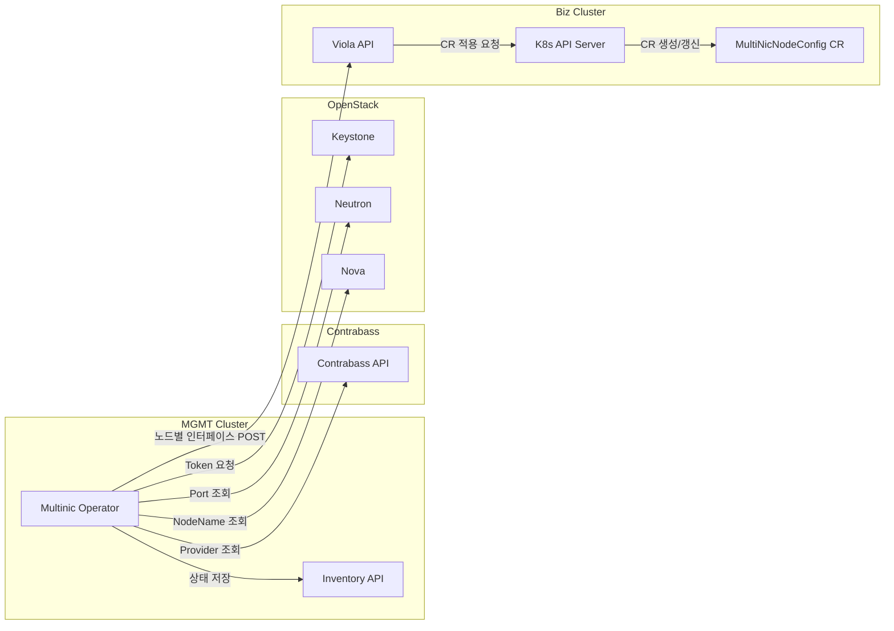
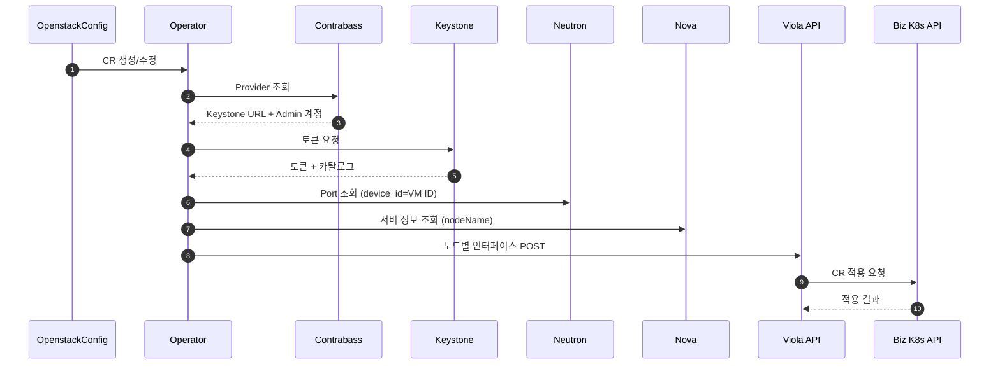

# multinic-operator

MGMT 클러스터에서 OpenstackConfig CR을 감시하고 OpenStack 네트워크 정보를 수집한 뒤
Biz 클러스터에 배포된 Viola API로 노드별 인터페이스 정보를 전송하는 오퍼레이터입니다.

## 개요

- 입력: OpenstackConfig CR (providerID, projectID, VM ID 목록 + settings/secrets)
- 처리: Contrabass → Keystone → Neutron 포트 조회
- 출력: Viola API로 JSON POST (MultiNicNodeConfig 생성용, subnetID 우선/없으면 subnetName)
- 저장: 오퍼레이터 내부 Inventory API + 파일 기반 DB(JSON)에 최신 상태 upsert (UI 조회용)

주의:
- `subnetID`가 **우선**이며, 없을 때만 `subnetName`을 사용합니다.
- `subnetName`은 네트워크명이 아니라 **서브넷 이름**입니다. (동일 이름이 있으면 오류)
- `vmNames`에는 **VM ID(UUID)** 를 넣어야 합니다.
- nodeName은 Nova 서버 이름을 사용하며, 필요 시 `settings.openstackNodeNameMetadataKey`로
  metadata 값을 우선 사용하도록 설정할 수 있습니다.
- 포트 상태가 `settings.openstackPortAllowedStatuses`에 포함되지 않거나,
  대상 노드의 인터페이스가 비어 있으면 해당 노드는 전송에서 제외됩니다.
- DOWN 포트가 남아 있으면 빠른 재시도 후(기본 5회) 느린 주기로 재전송합니다.
- 인터페이스 `id`는 0~9이며, `name`(multinic0~9)과 동일한 인덱스로 전송됩니다.

## 전제

- Go 1.25+
- Kubernetes 클러스터 접근 권한
- Contrabass/OpenStack API 접근 가능

## OpenstackConfig 설정

운영 환경에서는 Helm 배포 시 **이미지 정보만 설정**하고,
실제 접속 정보는 OpenstackConfig CR로 전달합니다.

필수 필드:
- `subnetID` 또는 `subnetName` (subnetID 권장)
- `vmNames`: VM ID(UUID) 목록
- `credentials.openstackProviderID`
- `credentials.projectID`

선택 필드:
- `credentials.k8sProviderID`
- `settings`: Contrabass/Viola/OpenStack/폴링 옵션
- `secrets.contrabassEncryptKeySecretRef` (권장)

기본 암호화 키:
- `<namespace>/contrabass-encrypt-key` Secret의 `CONTRABASS_ENCRYPT_KEY`를 자동 사용
- Secret이 없으면 `settings.contrabassEncryptKey`를 사용

Secret 예시:

```yaml
apiVersion: v1
kind: Secret
metadata:
  name: contrabass-encrypt-key
  namespace: multinic-system
type: Opaque
stringData:
  CONTRABASS_ENCRYPT_KEY: "conbaEncrypt2025"
```

OpenstackConfig 예시:

```yaml
apiVersion: multinic.example.com/v1alpha1
kind: OpenstackConfig
metadata:
  name: openstackconfig-sample
  namespace: multinic-system
spec:
  subnetID: "8f0d5f5b-8f3f-4b2b-9c4c-8c9f7c36d1f2"
  vmNames:
    - "08186d75-754e-449c-b210-c0ea822727a7"
    - "c863944f-5cfe-4e05-805f-7522f3e9b080"
    - "fbfd0e4d-a4bb-4769-bceb-46cb4b0dc3c5"
  credentials:
    openstackProviderID: "66da2e07-a09d-4797-b9c6-75a2ff91381e"
    projectID: "0d5f63c52fc94aeeb767e69790fa73c8"
    k8sProviderID: "f5861c22-b252-42b5-a0c5-cfb1d245c819"
  settings:
    contrabassEndpoint: "https://expert.bf.okestro.cloud"
    openstackPortAllowedStatuses:
      - "ACTIVE"
      - "DOWN"
    pollFastInterval: "10s"
    pollSlowInterval: "2m"
  secrets:
    contrabassEncryptKeySecretRef:
      name: contrabass-encrypt-key
      key: CONTRABASS_ENCRYPT_KEY
```

## 동작 흐름

### 아키텍처



### 시퀀스



1) OpenstackConfig CR 이벤트 발생
2) Contrabass provider 조회 및 adminPw 복호화
3) Keystone 토큰 발급 (서비스 카탈로그 포함)
4) Neutron 엔드포인트 결정 (카탈로그 또는 settings)
5) subnetID 또는 subnetName → subnet/network 조회 (CIDR/MTU 확보)
6) Neutron 포트 조회 (device_id == VM ID)
7) Nova 서버 조회로 nodeName 결정 (metadata key > server name > vmID)
8) 대상 subnet에 포함된 포트만 선별
9) 노드별 인터페이스 구성
10) Viola API POST
11) 파일 기반 DB(JSON) 최신 상태 upsert (providerId + nodeName 기준)
12) 변경 직후 빠른 폴링 → 안정 구간은 느린 폴링

## Viola API 요청 스펙

Operator가 OpenStack 포트 정보를 수집한 뒤 Biz 클러스터에 배포된 Viola API로 POST 요청을 보냅니다.
Viola API 주소는 Helm values의 `operatorConfig.violaEndpoint`로 설정합니다.

- Endpoint: `POST /v1/k8s/multinic/node-configs`
- Headers:
  - `x-provider-id` (string, optional): `k8sProviderID`가 있으면 그 값을 사용하고, 없으면 `openstackProviderID`를 사용
- Request Body: 노드별 MultiNicNodeConfig 목록(JSON 배열)

요청 필드:

| 구분 | key | type | required | description |
| --- | --- | --- | --- | --- |
| Body | `nodeName` | string | O | K8s 노드명 |
| Body | `instanceId` | string | O | OpenStack VM ID |
| Body | `interfaces` | array | O | 노드에 부착된 인터페이스 목록 |
| Body | `interfaces[].id` | int | O | 0~9 |
| Body | `interfaces[].name` | string | O | `multinic0`~`multinic9` |
| Body | `interfaces[].macAddress` | string | O | MAC 주소 |
| Body | `interfaces[].address` | string | O | IPv4 주소 |
| Body | `interfaces[].cidr` | string | O | 서브넷 CIDR |
| Body | `interfaces[].mtu` | int | O | MTU |

`x-provider-id` 값은 `OpenstackConfig.spec.credentials.k8sProviderID`가 있으면 그 값을 사용하고, 없으면 `openstackProviderID`를 사용합니다.

예시 (2개 노드, 각 3개 인터페이스):

```json
[
  {
    "nodeName": "worker-1",
    "instanceId": "i-0123456789abcdef0",
    "interfaces": [
      {
        "id": 0,
        "name": "multinic0",
        "macAddress": "00:1A:2B:3C:4D:5E",
        "address": "192.168.1.100",
        "cidr": "192.168.1.0/24",
        "mtu": 1500
      },
      {
        "id": 1,
        "name": "multinic1",
        "macAddress": "00:1A:2B:3C:4D:5F",
        "address": "192.168.1.101",
        "cidr": "192.168.1.0/24",
        "mtu": 1500
      },
      {
        "id": 2,
        "name": "multinic2",
        "macAddress": "00:1A:2B:3C:4D:60",
        "address": "192.168.1.102",
        "cidr": "192.168.1.0/24",
        "mtu": 1500
      }
    ]
  },
  {
    "nodeName": "worker-2",
    "instanceId": "i-0fedcba9876543210",
    "interfaces": [
      {
        "id": 0,
        "name": "multinic0",
        "macAddress": "00:1A:2B:3C:4D:61",
        "address": "192.168.2.10",
        "cidr": "192.168.2.0/24",
        "mtu": 1500
      },
      {
        "id": 1,
        "name": "multinic1",
        "macAddress": "00:1A:2B:3C:4D:62",
        "address": "192.168.2.11",
        "cidr": "192.168.2.0/24",
        "mtu": 1500
      },
      {
        "id": 2,
        "name": "multinic2",
        "macAddress": "00:1A:2B:3C:4D:63",
        "address": "192.168.2.12",
        "cidr": "192.168.2.0/24",
        "mtu": 1500
      }
    ]
  }
]
```

## Helm 배포

차트 경로: `deployments/helm`

Helm values에는 **이미지 정보 + Viola API 주소**가 필수입니다.
OpenStack/Contrabass 접속 정보는 OpenstackConfig CR로 전달합니다.

배포 예시:

```sh
helm upgrade --install multinic-operator deployments/helm \
  -n multinic-operator-system --create-namespace \
  --set image.repository=nexus.okestro-k8s.com:50000/multinic-operator \
  --set image.tag=dev-20260111021627 \
  --set image.pullSecrets[0].name=nexus-regcred
```

values.yaml 작성 예시(필수):

```yaml
image:
  repository: nexus.okestro-k8s.com:50000/multinic-operator
  tag: "dev-20260111021627"
  pullSecrets:
    - name: nexus-regcred
operatorConfig:
  violaEndpoint: "https://viola-api.example.com"
```

values.yaml 작성 예시(선택):

```yaml
inventory:
  enabled: true
  service:
    port: 18081
persistence:
  enabled: false
```

`operatorConfig.violaEndpoint`는 반드시 설정하고,
나머지 OpenstackConfig `settings`/`secrets`를 사용합니다.
Viola API 주소가 바뀌면 Helm values만 수정하면 됩니다.

## 오프라인 이미지 배포

사내망에서 인터넷 접근이 불가능할 때는 이미지 tar를 옮겨서 로드한 뒤
사내 Nexus로 push하고 Helm values에 반영합니다.

이미지 tar 경로:
- `images/multinic-operator_dev-20260111021627.tar`

예시:

```sh
# 이미지 로드
nerdctl load -i images/multinic-operator_dev-20260111021627.tar

# Nexus에 태그/푸시
nerdctl tag multinic-operator:dev-20260111021627 nexus.okestro-k8s.com:50000/multinic-operator:dev-20260111021627
nerdctl push nexus.okestro-k8s.com:50000/multinic-operator:dev-20260111021627
```

## Inventory API (오퍼레이터 내장)

- 목록 조회: `GET /v1/inventory/node-configs`
  - query: `providerId`, `nodeName`, `instanceId`
- 단건 조회: `GET /v1/inventory/node-configs/{nodeName}?providerId=...`

Kubernetes Service:
- Kustomize: `inventory-service` (port 18081, namespace `system`)
- Helm: `<release>-multinic-operator-inventory` (port 18081)

주의: 파일 기반 저장소이므로 오퍼레이터는 1개 replica로 운영하는 것을 권장합니다.
지속 저장이 필요하면 `config/manager/manager.yaml`의 `emptyDir`를 PVC로 교체하십시오.

### Inventory API 확인 예시

```sh
kubectl -n multinic-operator-system port-forward svc/<inventory-service-name> 18081:18081
curl -s "http://127.0.0.1:18081/v1/inventory/node-configs?providerId=<provider-id>"
curl -s "http://127.0.0.1:18081/v1/inventory/node-configs/<nodeName>?providerId=<provider-id>"
```

## Status Conditions

OpenstackConfig에는 동기화 상태를 나타내는 Conditions가 갱신됩니다.

- `Ready`: 동기화 성공 여부
- `Degraded`: 오류 발생 여부

추가 상태 필드:
- `lastSyncedAt`: 마지막 성공 동기화 시각(Reason=Synced/NoChange일 때 갱신)
- `lastError`: 마지막 오류 메시지

## 설치/배포 (기본)

```sh
make install
make deploy IMG=<registry>/multinic-operator:tag
```

샘플 CR 적용:

```sh
kubectl apply -k config/samples/
```

## 테스트용 Viola API

Viola 개발 API가 준비되기 전까지 아래 테스트용 API를 배포해 POST 수신 및 CR 생성까지 확인할 수 있습니다.

```sh
kubectl apply -f config/test/viola-test-api.yaml
```

동작 방식:
- POST payload를 `MultiNicNodeConfig`로 변환
- `kubectl apply -f`로 CR 생성/갱신

API 문서(테스트용):

- `GET /healthz`
  - Response: `200 OK` + `ok` (plain text)

- `POST /v1/k8s/multinic/node-configs`
  - Headers:
    - `Content-Type: application/json`
    - `x-provider-id` (optional, 라우팅 키)
  - Request Body: `[]NodeConfig` (JSON 배열)
  - Response `200 OK`:
    ```json
    {"applied":3,"output":"multinicnodeconfig.multinic.io/node-1 configured"}
    ```
  - Response `400 Bad Request`:
    - 잘못된 JSON/필수 필드 누락/라우팅 설정 오류
  - Response `500 Internal Server Error`:
    - `kubectl apply` 실패(검증 실패/접속 실패 등)

라우팅(테스트용):
- 요청 헤더 `x-provider-id`를 기준으로 대상 클러스터를 선택
- `ROUTING_CONFIG`에 라우팅 파일을 지정하면 providerId별로 SSH 적용 가능
- 샘플 파일: `config/test/viola-routing.sample.yaml`
- SSH 모드는 `sshpass`가 필요합니다. (distroless 테스트 이미지에는 포함되지 않으므로, 바이너리 실행 환경에 설치해야 합니다.)

라우팅 예시:

```yaml
targets:
  - providerId: "66da2e07-a09d-4797-b9c6-75a2ff91381e"
    mode: ssh
    namespace: "multinic-system"
    sshHost: "192.168.3.170"
    sshUser: "root"
    sshPort: 22
    sshPass: "cloud1234"
    kubectlPath: "kubectl"
```

이미지 빌드 예시:

```sh
nerdctl build -f Dockerfile.viola-test-api -t <registry>/multinic-viola-test-api:dev .
```

## QA 테스트 체크리스트

- [x] 3개 노드에 3개 포트씩 일괄 추가 후 CR 반영 확인
- [x] 포트 제거 시 CR 반영 확인
- [x] DOWN 포트 필터링(`openstackPortAllowedStatuses=ACTIVE`) 동작 확인
- [x] 설정 누락 시 ConfigError 발생/복구 확인 (`contrabassEndpoint`)
- [x] 중복 변경 스킵(`no changes detected`) 확인
- [x] 잘못된 VM ID/Project ID 입력 시 오류 처리 확인
- [x] Viola API 장애/timeout 시 재시도 동작 확인
- [x] Inventory API 조회 응답 확인
